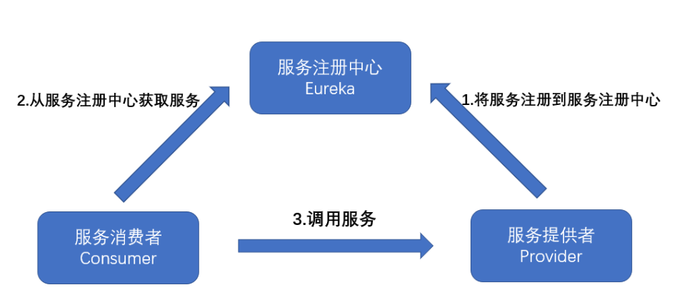
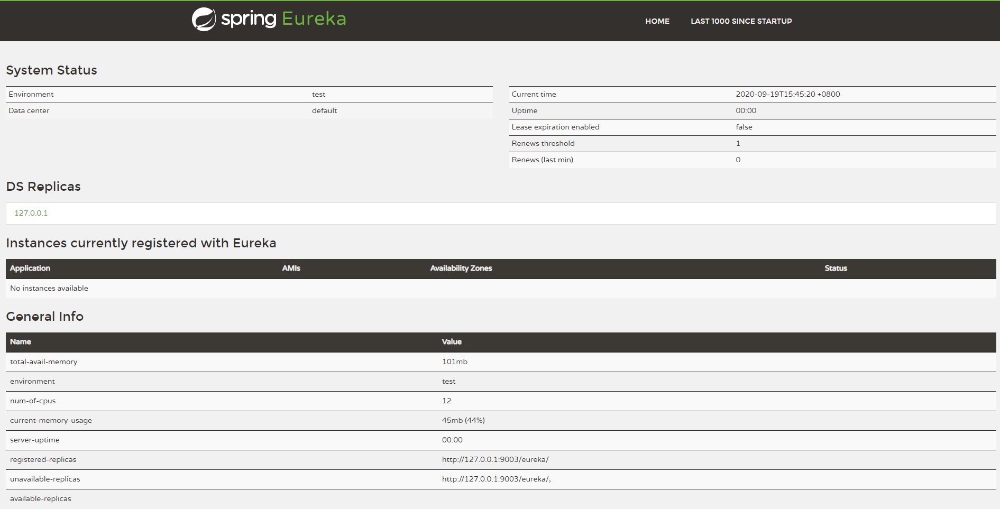
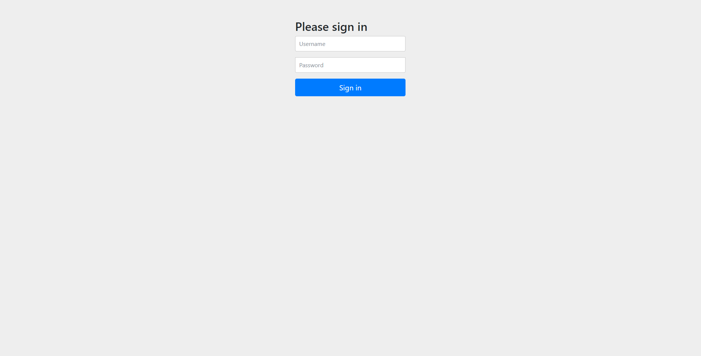

# Eureka注册中心-服务注册与发现

## 写在前面的废话
> 此文档为笔者的学习笔记，由于实际工作需要，所以内容更加偏向于实践操作，理论内容几乎没有，如果想了解理论知识可自行Google或百度。




## 关系调用说明
* 服务生产者启动时，向注册中心注册自己提供的服务;
* 服务消费者启动时，在注册中心订阅自己所需要的服务;
* 注册中心返回服务提供者的地址信息给消费者;
* 消费者从服务提供者中调用服务;

## Eureka简介
> Eureka是Spring Cloud Netflix微服务套件中的一部分，很容易与Spring Boot构建的微服务整合起来。服务器端，也被称作是服务注册中心，用于提供服务的注册与发现。Eureka支持高可用的配置，当集群中有分片出现故障时，Eureka就会转入自动保护模式，它允许分片故障期间继续提供服务的发现和注册，当故障分片恢复正常时，集群中其他分片会把他们的状态再次同步回来。

## 搭建服务注册中心
> 创建Spring Boot项目，加入依赖

```xml
<dependency>
    <groupId>org.springframework.cloud</groupId>
    <artifactId>spring-cloud-starter-netflix-eureka-server</artifactId>
</dependency>
```

> yml 配置文件

```yaml
spring:
  application:
    name: eureka-server # 设置服务名
server:
  port: 9003 # 端口号
eureka:
  client:
    service-url:
      defaultZone: http://127.0.0.1:9003/eureka/
    # 是否从eureka上获取注册信息
    fetch-registry: false
    # 表示是否注册自身到 eureka
    register-with-eureka: false
```
**启动类添加注解开启Eureka服务 `@EnableEurekaServer`**

启动项目访问 ``http://localhost:9003/`` 



## 开启密码验证

> 如果注册中心没有开启密码验证，只需要知道地址，谁都可以注册进去，安全性不高。所以需要在注册中心里面加入密码验证来确保安全性

> 添加依赖

```xml
<dependency>
	<groupId>org.springframework.boot</groupId>
	<artifactId>spring-boot-starter-security</artifactId>
</dependency>
```

> yml 配置文件

```yaml
spring:
  security:
    user:
      name: admin # 用户名
      password: 123456 # 密码
  application:
    name: eureka-server
server:
  port: 9003
eureka:
  client:
    service-url:
      defaultZone: http://127.0.0.1:9003/eureka/
    # 是否从eureka上获取注册信息
    fetch-registry: false
    # 表示是否注册自身到 eureka
    register-with-eureka: false
```

> 配置文件改好之后打开Spring Boot启动类，让启动类继承 ``WebSecurityConfigurerAdapter`` 这个类，并重写``configure``方法，Spring Security默认开启了所有 CSRF 攻击防御，需要禁用 /eureka 的防御:

```java
/**
 * @author Maxuhui
 */
@SpringBootApplication
@EnableEurekaServer
public class EurekaServerApplication extends WebSecurityConfigurerAdapter {

    public static void main(String[] args) {
        SpringApplication.run(EurekaServerApplication.class, args);
    }

    // 重写 configure()
    @Override
    protected void configure(HttpSecurity httpSecurity) throws Exception {
        super.configure(httpSecurity);
        httpSecurity.csrf().disable();
    }
}
```

重启项目，再次访问 ``http://localhost:9003/``  输入账号和密码即可




