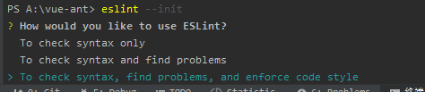
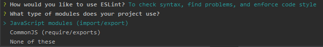
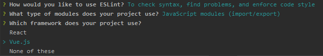
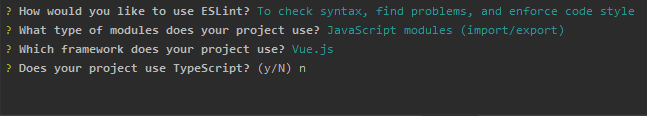
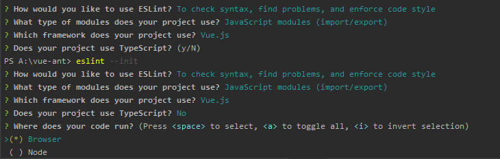
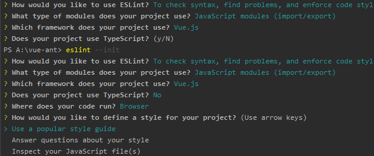
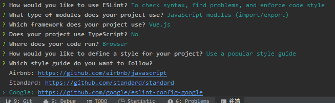
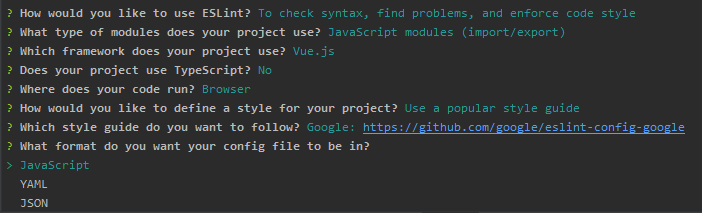
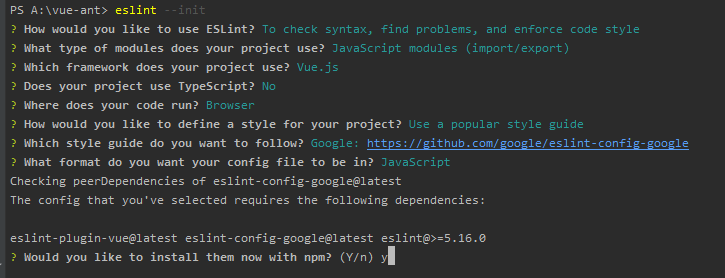

# Vue 项目搭建
## 安装 Eslint
+ 安装组件
```
npm install eslint --save-dev 
```
+ 初始化
```
eslint --init
```

> 选择第三个



> 选择第一个



> 选择第一个VUE



> 根据需要选择



> 选择第一个浏览器



> 选择第一个



> 选择Google(选择跟团队其他人一样的)



> 选择配置文件的格式



> 建议安装一些插件，选y是


